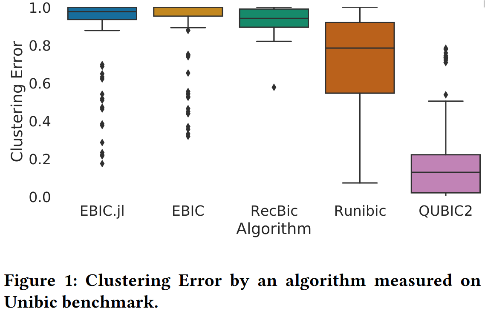

# EBIC.jl

EBIC is a next-generation biclustering algorithm based on artificial intelligence. EBIC is probably the first algorithm capable of discovering the most challenging patterns (i.e. row-constant, column-constant, shift, scale, shift-scale and trend-preserving) in complex and noisy data with average accuracy of over 90%. It is also one of the very few parallel biclustering algorithms that use at least one graphics processing unit (GPU) and is ready for big-data challenges.

The repository contains the new version of [EBIC](https://github.com/EpistasisLab/ebic) rewritten and improved.

<p align="center">
    
</p>

## Requirements

- Julia 1.6 or higher
- CUDA-capable GPU with compute capability 5.0 (Maxwell) or higher

## Setting up project

1. Clone the project.

2. Enter the project root directory.

3. Install dependencies

```bash
julia --project -E "using Pkg; Pkg.instantiate()"
```

4. Start quick test on `data/example_input.json` (running a Julia program takes siginificant amount of time because source code has to be compiled each time, Julia REPL is a recommended way of doing it).

```bash
julia --project src/EBIC.jl data/example_input.csv
```

## Getting test data

We provide three ready-to-use datasets which can be fetched from a remote DVC repository on Google Drive:
 - Unibic (69MB)
 - RecBic Maintext (211MB)
 - RecBic Sup (7.8GB)

[DVC](https://dvc.org) needs to be installed on your system to download the data.

```bash
pip install dvc[gdrive]
```

Run `dvc pull` to fetch all three datasets, whereas to download a particular one use `dvc pull <path_to_dataset_dvc>`, e.g., `dvc pull data/unibic.dvc`.

_When using DVC for the first time in a repository, one must authenticate with their Google account following instructions given by DVC._

## Usage

### Julia REPL

_This is the recommanded way of testing Julia applications._

#### Running the algorithm

The algorithm is run using `run_ebic()`. The function shares the same API as the command line version described below.
The example is run with extended results (`best_bclrs_stats`):

```julia
julia> using EBIC
julia> run_ebic("data/example_input.csv")
Progress: 100%|████████████████████| Time: 0:01:03
Dict{String, Any} with 5 entries:
  "data_load_time"      => 16.8467
  "biclusters"          => [Dict("rows"=>[31, 32, 33, 34, 35,…
  "last_iter_tabu_hits" => 305
  "algorithm_time"      => 63.0405
  "performed_iters"     => 744
```

#### Benchmarking the algorithm on the provided datasets

To test all three datasets at once run the following:

```julia
julia> using EBIC
julia> benchmark_all()
┌ Info: #############################
│ TEST GROUP: 'narrow_100_10'
└ ###################################
┌ Info: #############################
│ Test case  : narrow_100_10_data1.txt
└ Groundtruth: narrow_100_10_data1_hiddenBics.txt
Progress: 100%|████████████████████| Time: 0:00:59
┌ Info: Metrics:
│ Prelic relevance   : 1.0
│ Prelic recovery    : 1.0
│ Clustering error   : 1.0
└ Last iter tabu hits: 331
```

The above is the same as running the three functions one after another:

```julia
benchmark_unibic()
benchmark_recbic_maintext()
benchmark_recbic_sup()
```

The test results are save in `results/EBIC.jl` folder in the repository 
root directory by default, a different result path can be specified as an argument
(e.g., `benchmark_unibic(out_dir = "new_results")`).

### Command line

```
usage: EBIC.jl [-n MAX_ITERATIONS] [-b MAX_BICLUSTERS]
               [-x OVERLAP_THRESHOLD] [-t] [-g GPUS_NUM]
               [-a APPROX_TRENDS_RATIO] [-s] [-o] [-h] input_path

positional arguments:
  input_path            a path to the input file

optional arguments:
  -n, --max_iterations MAX_ITERATIONS
                        a maximum number of iterations to perform
                        (type: Int64, default: 2000)
  -b, --biclusters_num MAX_BICLUSTERS
                        a number of biclusters to be returned at the
                        end (type: Int64, default: 3)
  -x, --overlap_threshold OVERLAP_THRESHOLD
                        a maximum similarity level between two
                        chromosomes held in top rank list (type:
                        Float64, default: 0.75)
  -t, --negative_trends
                        enable negative trends (only in the last
                        itaration)
  -g, --gpus_num GPUS_NUM
                        a number of gpus the algorithm uses (not
                        supported yet) (type: Int64, default: 1)
  -a, --approx_trends APPROX_TRENDS_RATIO
                        allow trends that are monotonic in percentage
                        of columns (only in the last itaration) (type:
                        Float32, default: 0.85)
  -s, --best_bclrs_stats
                        evaluate additional statistics regarding the
                        best biclusters, slightly worsens overall
                        algorithm performance
  -o, --output          save biclusters to a JSON file, its file name
                        is a concatenation of the input file name and
                        '-res.json' suffix and is saved in the current
                        directory
  -h, --help            show this help message and exit
```

## Cite us

```
@inproceedings{10.1145/3449726.3463197,
    author = {Renc, Pawe\l{} and Orzechowski, Patryk and Byrski, Aleksander and W\u{a}s, Jaros\l{}aw and Moore, Jason H.},
    title = {EBIC.JL: An Efficient Implementation of Evolutionary Biclustering Algorithm in Julia},
    year = {2021},
    isbn = {9781450383516},
    publisher = {Association for Computing Machinery},
    address = {New York, NY, USA},
    url = {https://doi.org/10.1145/3449726.3463197},
    doi = {10.1145/3449726.3463197},
    booktitle = {Proceedings of the Genetic and Evolutionary Computation Conference Companion},
    pages = {1540–1548},
    numpages = {9},
    keywords = {data mining, biclustering, parallel algorithms, evolutionary computation, machine learning},
    location = {Lille, France},
    series = {GECCO '21}
}

@inproceedings{10.1145/3449726.3462739,
    author = {Renc, Pawe\l{} and Orzechowski, Patryk and Byrski, Aleksander and W\k{a}s, Jaros\l{}aw and Moore, Jason H.},
    title = {Rapid Prototyping of Evolution-Driven Biclustering Methods in Julia},
    year = {2021},
    isbn = {9781450383516},
    publisher = {Association for Computing Machinery},
    address = {New York, NY, USA},
    url = {https://doi.org/10.1145/3449726.3462739},
    doi = {10.1145/3449726.3462739},
    booktitle = {Proceedings of the Genetic and Evolutionary Computation Conference Companion},
    pages = {61–62},
    numpages = {2},
    keywords = {biclustering, evolutionary computation, parallel algorithms, data mining, machine learning},
    location = {Lille, France},
    series = {GECCO '21}
}
```

